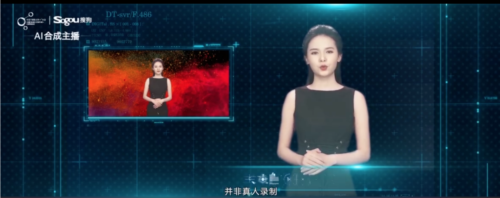

# Human Video Generation 
## Paper List
### 2018
- **Face2Face**: "Real-time Face Capture and Reenactment of RGB Videos" "CVPR" (2016) [[paper](https://web.stanford.edu/~zollhoef/papers/CVPR2016_Face2Face/paper.pdf)][[project](https://web.stanford.edu/~zollhoef/papers/CVPR2016_Face2Face/page.html)]
- **PSGAN**: "Pose Guided Human Video Generation" "ECCV" (2018) [[paper](http://openaccess.thecvf.com/content_ECCV_2018/papers/Ceyuan_Yang_Pose_Guided_Human_ECCV_2018_paper.pdf)]
- **DVP**: "Deep Video Portraits" "Siggraph"(2018) [[paper](https://web.stanford.edu/~zollhoef/papers/SG2018_DeepVideo/paper.pdf)][[project](https://web.stanford.edu/~zollhoef/papers/SG2018_DeepVideo/page.html)]
- **Recycle-GAN**: "Recycle-GAN: Unsupervised Video Retargeting" "ECCV"(2018) [[paper](https://www.cs.cmu.edu/~aayushb/Recycle-GAN/recycle_gan.pdf)][[project](https://www.cs.cmu.edu/~aayushb/Recycle-GAN/)][[code](https://github.com/aayushbansal/Recycle-GAN)]
- **X2Face**: "X2Face: A network for controlling face generation by using images, audio, and pose codes" "ECCV"(2018) [[paper](http://www.robots.ox.ac.uk/~vgg/publications/2018/Wiles18/wiles18.pdf)][[project](http://www.robots.ox.ac.uk/~vgg/research/unsup_learn_watch_faces/x2face.html)][[code](https://github.com/oawiles/X2Face)]
- **EBDN**: "Everybody Dance Now" "arXiv"(2018) [[paper](https://arxiv.org/pdf/1808.07371.pdf)][[project](https://carolineec.github.io/everybody_dance_now/)]
- **Vid2Vid**: "Video-to-Video Synthesis" "NIPS"(2018) [[paper](https://tcwang0509.github.io/vid2vid/paper_vid2vid.pdf)][[project](https://tcwang0509.github.io/vid2vid/)][[code](https://github.com/NVIDIA/vid2vid)]
### 2019
- **NAR**: "Neural Animation and Reenactment of Human Actor Videos" "Siggraph"(2019) [[paper](https://arxiv.org/abs/1809.03658)][[project](http://gvv.mpi-inf.mpg.de/projects/wxu/HumanReenactment/)]
- **TETH**: "Text-based Editing of Talking-head Video" "Siggraph"(2019) [[paper](https://www.ohadf.com/projects/text-based-editing/data/text-based-editing.pdf)][[project](https://www.ohadf.com/projects/text-based-editing/)]
- **VPC**: "Deep Video-Based Performance Cloning" "Eurographics"(2019) [[paper](https://arxiv.org/abs/1808.06847)]
- **FSTH**: "Few-Shot Adversarial Learning of Realistic Neural Talking Head Models" "CVPR"(2019) [[paper](https://arxiv.org/pdf/1905.08233.pdf)][[code unofficial](https://github.com/grey-eye/talking-heads)]
- **TNA**: "Textured Neural Avatars" "CVPR"(2019) [[paper](https://arxiv.org/abs/1905.08776)][[project](https://saic-violet.github.io/texturedavatar/)]
- **VOCA**: "Voice Operated Character Animation" "CVPR"(2019) [[paper](https://ps.is.tuebingen.mpg.de/uploads_file/attachment/attachment/510/paper_final.pdf)][[project](https://voca.is.tue.mpg.de/)][[code](https://github.com/TimoBolkart/voca)]
- **Audio2Face**: "Audio2Face: Generating Speech/Face Animation from Single Audio with Attention-Based Bidirectional LSTM Networks" "arXiv"(2019) [[paper](https://arxiv.org/abs/1905.11142)
- **RSDA**: "Realistic Speech-Driven Animation with GANs" "arXiv"(2019) [[paper](https://arxiv.org/abs/1906.06337)][[project](https://sites.google.com/view/facial-animation)][[code](https://github.com/DinoMan/speech-driven-animation)]
- **LISCG**: "Learning Individual Styles of Conversational Gesture" "arXiv"(2019) [[paper](https://arxiv.org/abs/1906.04160)] [[project](http://people.eecs.berkeley.edu/~shiry/projects/speech2gesture/)][[code](https://github.com/amirbar/speech2gesture)]
- **AUDIO2FACE**: "EAUDIO2FACE: GENERATING SPEECH/FACE ANIMATION FROM SINGLE AUDIO WITH ATTENTION-BASED BIDIRECTIONAL LSTM NETWORKS" "ICMI"(2019)
- **AvatarSim**: "A High-Fidelity Open Embodied Avatar with Lip Syncing and Expression Capabilities" "ICMI"(2019) [code](https://github.com/danmcduff/AvatarSim)
- **NVP**: "Neural Voice Puppetry: Audio-driven Facial Reenactment" "arXiv"(2019) [[paper](https://arxiv.org/pdf/1912.05566.pdf)]
- **CSGN**: "Convolutional Sequence Generation for Skeleton-Based Action Synthesis" "ICCV"(2019) [[paper](http://yjxiong.me/papers/iccv19csgn.pdf)]
- **Few shot VID2VID**: "Few-shot Video-to-Video Synthesis" [[paper](https://nvlabs.github.io/few-shot-vid2vid/main.pdf)] [[project](https://nvlabs.github.io/few-shot-vid2vid/)] [[code](https://github.com/NVlabs/few-shot-vid2vid)]
- **FOM**: "First Order Motion Model for Image Animation" "NIPS"(2019) [[paper](http://papers.nips.cc/paper/8935-first-order-motion-model-for-image-animation.pdf)] [[project](https://aliaksandrsiarohin.github.io/first-order-model-website/)] [[code](https://github.com/AliaksandrSiarohin/first-order-model)]
### 2020
- **TransMoMo**: "TransMoMo: Invariance-Driven Unsupervised Video Motion Retargeting" "CVPR"(2020) [[paper](https://arxiv.org/pdf/2003.14401.pdf)] [[project](https://yzhq97.github.io/transmomo/)] [[code](https://github.com/yzhq97/transmomo.pytorch)]
- **poseflow**: "Deep Image Spatial Transformation for Person Image Generation" "CVPR"(2020) [[paper](https://arxiv.org/abs/2003.00696)] [[project](https://renyurui.github.io/GFLA-web/)] [[code](https://github.com/RenYurui/Global-Flow-Local-Attention)]
- **PIFuHD**: "PIFuHD: Multi-Level Pixel-Aligned Implicit Function for High-Resolution 3D Human Digitization" "CVPR(Oral)"(2020) [[paper](https://arxiv.org/pdf/2004.00452.pdf)] [[project](https://shunsukesaito.github.io/PIFuHD/)] [[code](https://github.com/facebookresearch/pifuhd)]
- **Hifi3dface**: "High-Fidelity 3D Digital Human Creation from RGB-D Selfies" "arXiv"(2020.10) [[paper](https://arxiv.org/pdf/2010.05562.pdf)][[project](https://tencent-ailab.github.io/hifi3dface_projpage/)] [[code](https://github.com/tencent-ailab/hifi3dface)]
- **face-vid2vid**: "One-Shot Free-View Neural Talking-Head Synthesis for Video Conferencing" "arXiv"(2020.11) [[paper](https://arxiv.org/abs/2011.15126)] [[project](https://nvlabs.github.io/face-vid2vid/)] [[code](https://github.com/NVlabs/face-vid2vid)]
- **HeadGan**: "HeadGAN: Video-and-Audio-Driven Talking Head Synthesis" "arXiv"(2020.12) [[paper](https://arxiv.org/pdf/2012.08261.pdf)]
- "Audio-driven Talking Face Video Generation with Learning-based Personalized Head Pose" "arXiv"(2020) [[paper](http://arxiv.org/abs/2002.10137)][[code](https://github.com/yiranran/Audio-driven-TalkingFace-HeadPose)]

### 2021
- **Talking-Face_PC-AVS**: "Pose-Controllable Talking Face Generation by Implicitly Modularized Audio-Visual Representation" "CVPR"(2021) [[code](https://github.com/Hangz-nju-cuhk/Talking-Face_PC-AVS)][[project](https://hangz-nju-cuhk.github.io/projects/PC-AVS)][[demo](https://www.youtube.com/watch?v=lNQQHIggnUg)]
- **Pixel Codec Avatar** "Pixel Codec Avatars" "arXiv"(2021.04) [[paper](https://arxiv.org/pdf/2104.04638.pdf)]
- **MRAA** "Motion Representations for Articulated Animation"  "CVPR"(2021) [[project](https://aliaksandrsiarohin.github.io/motion-representation-website/)]
- **NWT** "Towards natural audio-to-video generation with representation learning" "arXiv"(2021)[[paper](https://arxiv.org/pdf/2106.04283.pdf)][[project](https://next-week-tonight.github.io/NWT/)]
- **LipSync3D** Data-Efficient Learning of Personalized 3D Talking Faces from Video using Pose and Lighting Normalization "arXiv"(2021) [[paper](https://arxiv.org/pdf/2106.04185.pdf)][[demo](https://www.youtube.com/watch?v=L1StbX9OznY)]
- **AD-NeRF** Audio Driven Neural Radiance Fields for Talking Head Synthesis "ICCV"(2021) [[paper](https://arxiv.org/abs/2103.11078)][[codde](https://github.com/YudongGuo/AD-NeRF)][[demo](https://www.youtube.com/watch?v=TQO2EBYXLyU)][[project](https://yudongguo.github.io/ADNeRF/)]

## Applications
### Face Swap
- ZAO: a hot app.

### AI Host: 

## Dataset

## Researchers & Teams

1. [Graphics, Vision & Video at MPII](http://gvv.mpi-inf.mpg.de/)
2. [REAL VIRTUAL HUMANS at MPII](https://virtualhumans.mpi-inf.mpg.de/)
3. [Visual Computing Group at TUM](http://www.niessnerlab.org/index.html)
4. [Perceiving Systems Department at MPII](https://ps.is.tuebingen.mpg.de/)
